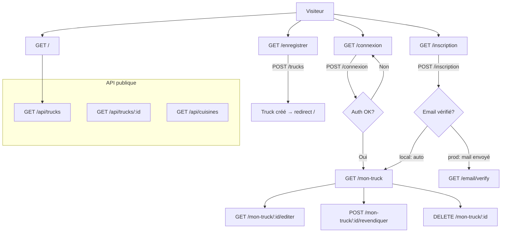

# Routes — TruckMap

**Dernière mise à jour :** 2026-07-11
**Branche de référence :** `main`

---

## Table des matières

1. [Vue d'ensemble](#1-vue-densemble)
2. [Routes publiques](#2-routes-publiques)
3. [Routes authentification](#3-routes-authentification)
4. [Routes protégées (auth)](#4-routes-protégées-auth)
5. [Routes API](#5-routes-api)
6. [Diagramme](#6-diagramme)

---

## 1. Vue d'ensemble

Le projet utilise **[Wayfinder](https://github.com/laravel/wayfinder)** pour les types TypeScript des routes — pas Ziggy. Côté Vue, utiliser des URLs directes (`href="/connexion"`), pas de helper `route()`.

| Middleware | Description |
|---|---|
| `guest` | Redirige vers `/mon-truck` si déjà connecté |
| `auth` | Redirige vers `/connexion` si non connecté |
| `verified` | Requiert vérification email (sauf `local`) |
| `throttle:60,1` | 60 requêtes/minute par IP |

---

## 2. Routes publiques

| Méthode | URI | Contrôleur | Description |
|---|---|---|---|
| `GET` | `/` | `HomeController@index` | Page d'accueil avec carte interactive |

---

## 3. Routes authentification

Toutes sous middleware `guest` (redirigent si déjà connecté).

| Méthode | URI | Contrôleur | Description |
|---|---|---|---|
| `GET` | `/connexion` | `AuthController@showLogin` | Formulaire de connexion |
| `POST` | `/connexion` | `AuthController@login` | Traitement connexion (`throttle:10,1`) |
| `GET` | `/inscription` | `AuthController@showRegister` | Formulaire d'inscription |
| `POST` | `/inscription` | `AuthController@register` | Création de compte (`throttle:5,1`) |
| `POST` | `/deconnexion` | `AuthController@logout` | Déconnexion (middleware `auth`) |

### Vérification email

| Méthode | URI | Description |
|---|---|---|
| `GET` | `/email/verify` | Page "Vérifiez votre email" (auth requis) |
| `GET` | `/email/verify/{id}/{hash}` | Lien de vérification signé |
| `POST` | `/email/verification-notification` | Renvoi du mail (throttle 6/min) |

> **Note.** En environnement `local`, les emails sont auto-vérifiés à l'inscription. En production, l'événement `Registered` est dispatché et Laravel envoie l'email via la config SMTP.

---

## 4. Routes protégées (auth)

Middleware `auth` + `verified` sur toutes.

### Enregistrement d'un truck

| Méthode | URI | Contrôleur | Description |
|---|---|---|---|
| `GET` | `/enregistrer` | `TruckController@create` | Wizard 3 étapes (Inertia `Register/Index`) |
| `POST` | `/trucks` | `TruckController@store` | Création truck + localisation + horaires |
| `GET` | `/trucks/check-name` | `TruckController@checkName` | Vérification doublon de nom (AJAX) |

### Espace admin (`/mon-truck`)

Préfixe `admin.`, middleware `auth` + `verified`.

| Méthode | URI | Contrôleur | Description |
|---|---|---|---|
| `GET` | `/mon-truck` | `TruckAdminController@index` | Liste mes trucks + trucks non revendiqués |
| `POST` | `/mon-truck/{truck}/revendiquer` | `TruckAdminController@claim` | Revendiquer un truck sans propriétaire |
| `GET` | `/mon-truck/{truck}/editer` | `TruckAdminController@edit` | Formulaire d'édition |
| `PUT` | `/mon-truck/{truck}` | `TruckAdminController@update` | Mise à jour (ownership vérifié via `abort_if`) |
| `DELETE` | `/mon-truck/{truck}` | `TruckAdminController@destroy` | Suppression (ownership vérifié) |

> **Ownership.** Chaque action vérifie `$truck->user_id !== Auth::id()` → `abort(403)`. L'update supprime toutes les locations + les recrée (plus simple qu'un diff de schedules).

---

## 5. Routes API

Préfixe `/api`, sans middleware session. Lecture publique.

| Méthode | URI | Contrôleur | Description |
|---|---|---|---|
| `GET` | `/api/trucks` | `TruckController@index` | Liste paginée avec filtres |
| `GET` | `/api/trucks/{id}` | `TruckController@show` | Détail d'un truck |
| `GET` | `/api/cuisines` | `CuisineController@index` | Liste des 10 cuisines |

Voir [`docs/api.md`](api.md) pour le détail des paramètres et schémas.

---

## 6. Diagramme

